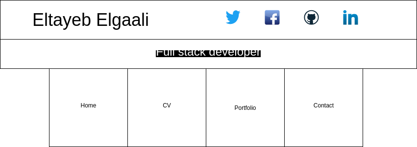

# Personal Portfolio
- This is a personal portfolio that developed using javascript on applying asynchronous Programming.
- The aim of this project is to practice asynchronous Programming by using fetch.

---

## User Story Dependencies

[Story Dependency Diagram](https://excalidraw.com/)

---

## WIREFRAME

---

## 0.Setup

**A User can see my initial repository and live demo**

### Repository

- Created a new repository from this [boilerplate repository](https://github.com/HackYourFutureBelgium/starter-basic-import-export)
- Clone the repository
- Add a wireframe
- Start the development strategy
- Write initial, basic README
- Push the changes to GitHub
- Turn on GitHub Page
- Put reference to the project in the my personal issue

---

## 1. Initialize Application

__As a user I want to see the initial page when I load the site__

### REPO

- This user story is developed on branch `initial-application`.
- This branch is merged to `master` branch after completion.

### HTML

- Add a Header with one `row` and two columns 4 and 8 width via bootstrap

### CSS

- Add some styling

### Assets

- Add references links and font directory and images

---

## 2. Home section

__As a user I want to see the home section when I click on Home__

### REPO

- This user story is developed on branch `home-section`.
- This branch is merged to `master` branch after completion.

### HTML

- Add a `div` containing home section

### Javascript

- Add collapse functionality

### Assets

---

## 3. CV

__As a user I want to see the CV section when I click on CV__

### REPO

- This user story is developed on branch `cv-section`.
- This branch is merged to `master` branch after completion.

### HTML

- Add a `div` containing cv section

### Javascript

### Assets

---

## 4. Portfolio

__As a user I want to see the portfolio section when I click on portfolio__

### REPO

- This user story is developed on branch `portfolio-section`.
- This branch is merged to `master` branch after completion.

### HTML

- Add a `div` containing portfolio section

### Javascript

---

## 5. Repositories

__As a user I want to see repositories when I click on Repositories button__

### REPO

- This user story is developed on branch `fetch-repo-data`.
- This branch is merged to `master` branch after completion.

### Javascript

#### Data 

- Add repo class

#### Handler

- Add get-repos-handler script

#### Listener

- Add a listener to repositories button

#### Log

- Log result of parsed response

###  CSS

- Add some styling

---

## 6. Contact and Footer

__As a user I want to see contact section__

### REPO

- This user story is developed on branch `contact-footer`.
- This branch is merged to `master` branch after completion.

### HTML

- Add contact and footer divs

---
